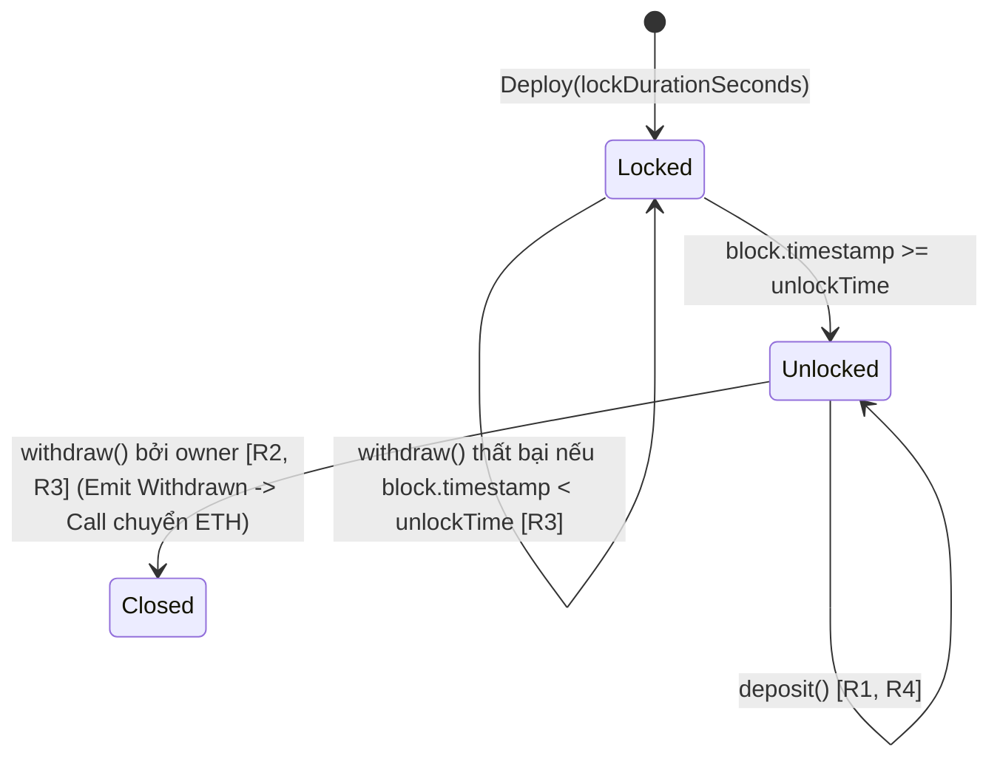

# ĐẶC TẢ KỸ THUẬT: KÉT TIẾT KIỆM CÓ KHÓA THỜI GIAN (TimeLockVault)

> **Môn học:** ECO2432 Web3 Starter — Lab 09  
> **Tài liệu đặc tả:** `contracts/training/SPEC.md`  
> **Mã nguồn hợp đồng:** `contracts/training/TimeLockVault.sol`

---

## 1. Mục đích
Hợp đồng mô phỏng mô hình ký gửi có điều kiện (conditional escrow / timelock vault) làm nền tảng cho các sản phẩm giữ hộ tiền: đặt cọc, ký quỹ mua bán, tiết kiệm có kỳ hạn.
Chủ két nạp tiền vào két và chỉ có thể rút ra sau một khoảng thời gian khóa đã định trước. Trước mốc thời gian đó, kể cả chủ sở hữu két cũng không thể rút tiền.

---

## 2. Tham số & Vai trò

| Tham số / Biến | Kiểu dữ liệu | Vai trò | Diễn giải |
| :--- | :--- | :--- | :--- |
| `owner` | `address` | Biến trạng thái | Địa chỉ ví người tạo két (người thụ hưởng rút tiền sau khi mở khóa). |
| `unlockTime` | `uint256` | Biến trạng thái | Mốc thời gian Unix (giây) tính từ lúc deploy mà sau đó tiền mới được phép rút. |
| `lockDurationSeconds` | `uint256` | Tham số khởi tạo | Khoảng thời gian khóa tính bằng giây (ví dụ: 120 giây = 2 phút). |
| `msg.value` | `uint256` | Tham số giao dịch | Số lượng ETH (Wei) gửi vào két khi nạp tiền. |

---

## 3. Quy tắc nghiệp vụ (5 quy tắc cốt lõi)

- **R1 (Nạp tiền tự do):** Bất kỳ ai cũng có thể nạp ETH vào két thông qua hàm `deposit()`.
- **R2 (Phân quyền rút tiền):** Chỉ người tạo két (`owner`) mới có quyền thực hiện rút tiền thông qua hàm `withdraw()`. Bất kỳ địa chỉ ví nào khác gọi lệnh đều bị từ chối với lỗi `NotOwner()`.
- **R3 (Khóa thời gian):** Tiền chỉ được phép rút ra khi thời điểm hiện tại trên blockchain đã chạm hoặc vượt qua mốc mở khóa (`block.timestamp >= unlockTime`). Nếu gọi trước thời điểm này, giao dịch bị từ chối với lỗi `StillLocked(unlockTime, block.timestamp)`.
- **R4 (Ràng buộc giá trị nạp):** Số tiền gửi vào két phải lớn hơn 0 (`msg.value > 0`). Nếu gửi giao dịch nạp 0 ETH, giao dịch bị từ chối với lỗi `ZeroAmount()`.
- **R5 (Minh bạch sự kiện On-chain):** Mọi lần nạp tiền và rút tiền đều phải phát sự kiện `Deposited(address indexed from, uint256 amount)` và `Withdrawn(address indexed to, uint256 amount)` để cho phép tra cứu, lọc và kiểm toán lịch sử trên blockchain.

---

## 4. Máy trạng thái & Kiểm soát luồng Checks-Effects-Interactions

### Quy trình Checks - Effects - Interactions trong `withdraw()`:
1. **Checks:**
   - `msg.sender == owner` (nếu sai revert `NotOwner()`)
   - `block.timestamp >= unlockTime` (nếu sai revert `StillLocked(unlockTime, block.timestamp)`)
   - `address(this).balance > 0` (nếu sai revert `NothingToWithdraw()`)
2. **Effects:**
   - Lưu số dư tạm thời `amount = address(this).balance`
   - Phát sự kiện `emit Withdrawn(owner, amount)` trước khi chuyển giao quyền kiểm soát ra bên ngoài.
3. **Interactions:**
   - Chuyển toàn bộ số dư cho `owner` bằng cú pháp `call{value: amount}("")`.
   - Kiểm tra kết quả trả về `require(ok, "Chuyen tien that bai")`.

---

## 5. Các trường hợp kiểm thử (Tối thiểu 3 ca kiểm thử)

### Case 1: Luồng chuẩn (Happy Path)
- **Kịch bản:** Deploy két với `lockDurationSeconds = 120`. Tài khoản A nạp 1 ETH (`deposit`). Sau 125 giây, `owner` gọi `withdraw()`.
- **Kết quả kỳ vọng:** Rút thành công 1 ETH về ví `owner`, két phát sinh sự kiện `Withdrawn`, số dư két về 0.

### Case 2: Kiểm thử khóa thời gian (Time-lock enforcement)
- **Kịch bản:** Sau khi nạp 1 ETH, tại giây thứ 30 (`block.timestamp < unlockTime`), `owner` lập tức gọi `withdraw()`.
- **Kết quả kỳ vọng:** Giao dịch bị revert với lỗi tùy biến `StillLocked(unlockTime, currentTime)`. Toàn bộ tiền vẫn an toàn trong két.

### Case 3: Trường hợp gian lận / Trộm tiền (Attacker Fraud Case)
- **Kịch bản:** Két đã hết hạn khóa (`block.timestamp >= unlockTime`). Kẻ tấn công (địa chỉ lạ `attacker != owner`) cố gắng gọi hàm `withdraw()` nhằm rút trộm tiền của két về ví của mình.
- **Kết quả kỳ vọng:** Giao dịch lập tức bị từ chối với lỗi `NotOwner()`. Kẻ tấn công tốn gas mà không thể lấy được bất kỳ wei nào từ hợp đồng.
